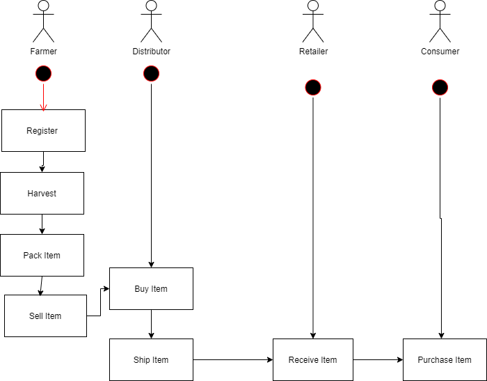
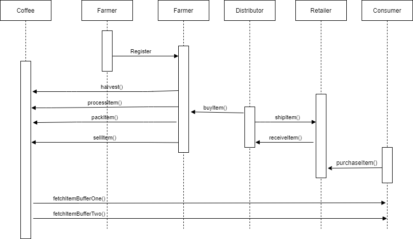
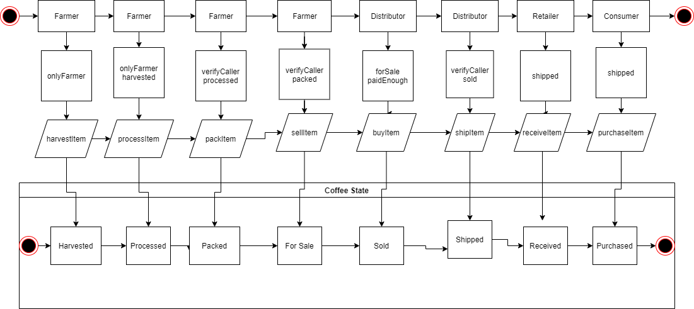
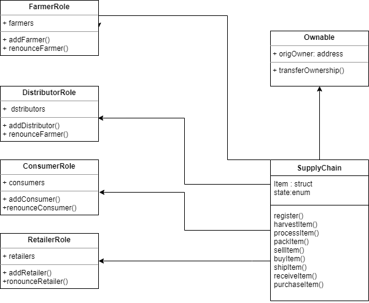
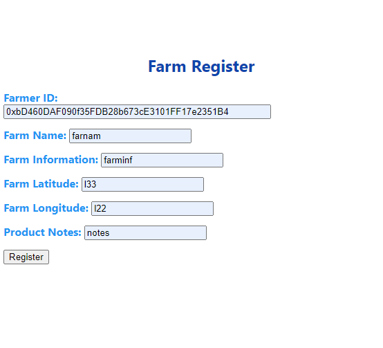
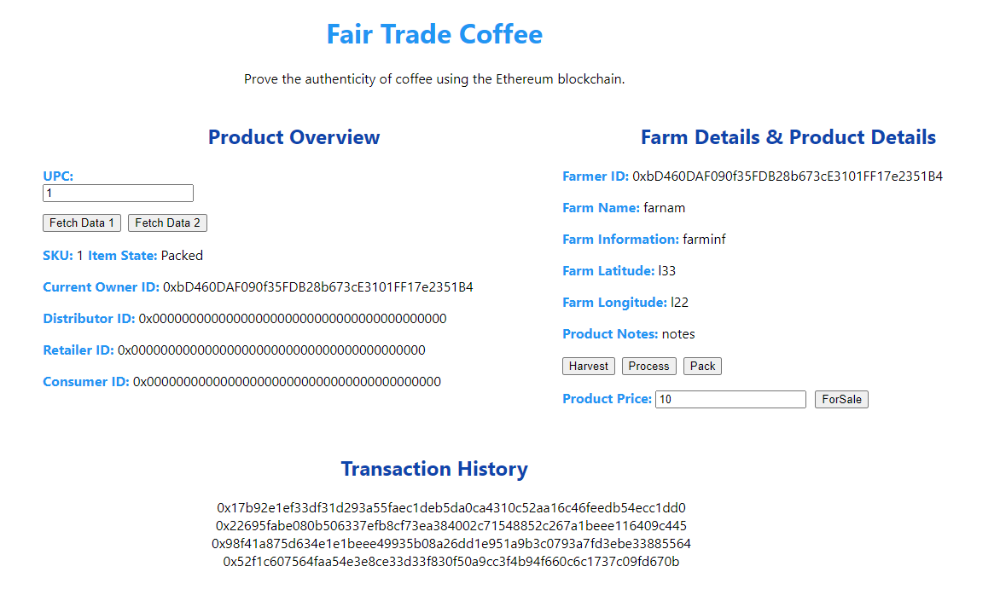
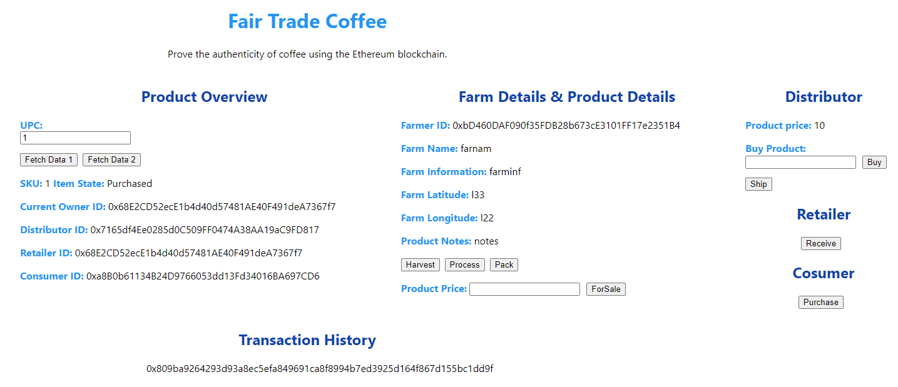

# Supply chain & data auditing

This repository containts an Ethereum DApp that demonstrates a Supply Chain flow between a Farmer, Distributor, Retailer and Consumer. The user story is similar to any commonly used supply chain process. A Farmer can register and add items to the inventory system stored in the blockchain. A registered farmer can put a harvested and packed item for sale. A Distributor can purchase such items from the inventory system and ship to Retailer. Additionally a Distributor can mark an item as Shipped, and similarly a Retailer can mark an item as Received. Then Consumer can purchase the item.

UML diagrams:  

Activity Diagram



Sequence Diagram:



State Diagram:



Class Diagram (Data Model):



The DApp User Interface when running should look like...








## Getting Started

These instructions will get you a copy of the project up and running on your local machine for development and testing purposes. See deployment for notes on how to deploy the project on a live system.  

This project was created using:  
- Truffle version: v5.4.3 (core: 5.4.3).  
- Solidity - 0.8.6 (solc-js).  
- Web3.js v1.5.0  
- Node v14.15.3 

Libraries  
Roles library was used to make easier to manage AccessControl.


### Prerequisites

Please make sure you've already installed ganache-cli, Truffle and enabled MetaMask extension in your browser.


### Installing

> The starter code is written for **Solidity v0.8.6**. To use this starter code, please run `npm i -g truffle`. 

A step by step series of examples that tell you have to get a development env running

Clone this repository:

```
git clone https://github.com/ik69/uda_supply_chain.git
```

Change directory to ```uda_supply_chain``` folder and install all requisite npm packages (as listed in ```client/package.json```):

```
cd uda_supply_chain/client
npm install
```

Launch Ganache


In a separate terminal window, Compile smart contracts:

```
truffle compile
```


This will create the smart contract artifacts in folder ```src\contracts```.

Migrate smart contracts to the locally running blockchain, ganache-cli:

```
truffle migrate
```


Test smart contracts:

```
truffle test
```

All 10 tests should pass.


In a separate terminal window, launch the DApp:

```
npm run start
```

## Built With

* [Ethereum](https://www.ethereum.org/) - Ethereum is a decentralized platform that runs smart contracts

* [Truffle Framework](http://truffleframework.com/) with Truffle react box
- Truffle is the most popular development framework for Ethereum with a mission to make your life a whole lot easier.


## Acknowledgments

* Solidity
* Ganache-cli
* Truffle

- SupplyChain Address on the Rinkeby Network  - 0x3B6deaB889281445Ed7CE24C06459c824d01a04F
- transaction hash:    0x1f3e641db1e8fe26de758504c0dccb3d8041aa862694eef43f82ebd8b5c5dc3c